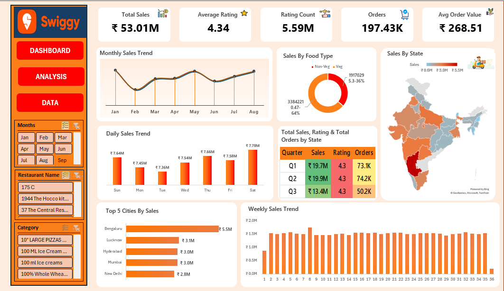

# 🍔 Swiggy Sales & Food Delivery Analysis — Excel

An Excel-based business analytics project analyzing **197K+ Swiggy food-delivery records** to identify price-value trends, food preferences, restaurant performance, customer ratings, and geographic patterns.

---

## 📊 Dashboard Preview



---

## 🎯 Business Objective

The objective of this project is to transform a large raw Swiggy dataset into meaningful business insights using **Microsoft Excel**.

The analysis helps answer important business questions:

* Which cities and states have the highest represented value?
* Which food types contribute the most value?
* Which months and days perform better?
* Which food categories have higher average prices?
* What is the overall customer rating?
* Which restaurants and locations have strong representation?
* Where should management focus marketing and expansion efforts?

---

## 🛠️ Tools & Excel Skills

### Tool

**Microsoft Excel**

### Skills Used

* Data Cleaning
* Data Validation
* Excel Tables
* Excel Formulas
* KPI Calculations
* Pivot Tables
* Pivot Charts
* Slicers
* Conditional Formatting
* Data Visualization
* Dashboard Development
* Trend Analysis
* Geographic Analysis
* Category Analysis
* Business Analysis

---

## 📂 Dataset

The dataset contains:

* **197,430 records**
* **14 columns**
* Date range: **January 1, 2025 – August 31, 2025**

### Important Columns

| Column          | Description                          |
| --------------- | ------------------------------------ |
| State           | State associated with the restaurant |
| City            | City associated with the restaurant  |
| Order Date      | Date associated with the record      |
| Day             | Day of the week                      |
| Quarter         | Quarter                              |
| Week            | Week number                          |
| Restaurant Name | Restaurant name                      |
| Location        | Restaurant/locality                  |
| Category        | Food/menu category                   |
| Dish Name       | Menu item                            |
| Food Type       | Veg / Non-Veg                        |
| Price (INR)     | Listed price/value                   |
| Rating          | Customer rating                      |
| Rating Count    | Number of ratings                    |

---

# 🔍 Business Questions

### Sales & Performance

1. What is the total price value represented in the dataset?
2. What is the average listed price?
3. Which month performs best?
4. Which quarter performs best?
5. Which day of the week performs best?

### Food Analysis

6. What is the contribution of Veg and Non-Veg food?
7. Which categories have the highest represented value?
8. Which categories have higher average prices?

### Geographic Analysis

9. Which states perform best?
10. Which cities perform best?
11. Which locations have strong representation?

### Customer Experience

12. What is the average rating?
13. What is the total rating count?
14. How can ratings be incorporated into restaurant evaluation?

---

# 📊 Key Performance Indicators

| KPI                  |   Result |
| -------------------- | -------: |
| Dataset Records      |  197,430 |
| Columns              |       14 |
| Total Price Value    |  ₹53.01M |
| Average Listed Price |  ₹268.51 |
| Average Rating       | 4.34 / 5 |
| Rating Count         |    5.59M |

> **Important:** The ₹53.01M figure represents the summed `Price (INR)` value available in the dataset. It should not be interpreted as confirmed Swiggy revenue.

---

# 🥗 Veg vs Non-Veg Analysis

| Food Type | Price Value |
| --------- | ----------: |
| Veg       |     ₹33.84M |
| Non-Veg   |     ₹19.17M |
| **Total** | **₹53.01M** |

### Key Insights

* Veg represents approximately **63.8%** of the represented price value.
* Non-Veg represents approximately **36.2%**.
* Non-Veg has a higher average listed price than Veg.

| Food Type | Average Price |
| --------- | ------------: |
| Veg       |       ₹240.73 |
| Non-Veg   |       ₹337.22 |

### Business Recommendation

Maintain a strong Veg offering for broad customer demand while using higher-priced Non-Veg products as potential premium and upselling opportunities.

---

# 📅 Monthly Analysis

| Month    | Price Value |
| -------- | ----------: |
| January  |      ₹6.83M |
| February |      ₹6.27M |
| March    |      ₹6.57M |
| April    |      ₹6.59M |
| May      |      ₹6.79M |
| June     |      ₹6.51M |
| July     |      ₹6.65M |
| August   |      ₹6.79M |

### Insight

January has the highest represented monthly value at approximately **₹6.83M**, while February has the lowest at approximately **₹6.27M**.

### Business Recommendation

Investigate weaker months to understand changes in demand, promotions, restaurant availability, and category performance.

---

# 📊 Quarterly Analysis

| Quarter | Price Value | Records |
| ------- | ----------: | ------: |
| Q1      |     ₹19.67M |  73,096 |
| Q2      |     ₹19.90M |  74,163 |
| Q3      |     ₹13.44M |  50,171 |

### Insight

Q2 has the highest represented value at approximately **₹19.90M**.

### Data Consideration

Q3 is a **partial quarter** because the dataset ends on August 31, 2025. Therefore, the lower Q3 value should not automatically be interpreted as a business decline.

---

# 📆 Day-of-Week Analysis

| Day       | Price Value |
| --------- | ----------: |
| Saturday  |      ₹7.78M |
| Sunday    |      ₹7.64M |
| Thursday  |      ₹7.66M |
| Friday    |      ₹7.58M |
| Wednesday |      ₹7.54M |
| Monday    |      ₹7.45M |
| Tuesday   |      ₹7.36M |

### Insight

Saturday has the highest represented value, while Tuesday has the lowest.

### Business Recommendation

Test targeted weekend campaigns, family offers, combo promotions, and weekday offers designed to improve weaker periods.

---

# 🌍 State-Level Analysis

### Top Represented States

| Rank | State         | Price Value |
| ---: | ------------- | ----------: |
|    1 | Karnataka     |      ₹5.46M |
|    2 | Uttar Pradesh |      ₹3.12M |
|    3 | Telangana     |      ₹3.02M |
|    4 | Maharashtra   |      ₹3.02M |
|    5 | Delhi         |      ₹2.83M |
|    6 | Gujarat       |      ₹2.82M |
|    7 | Punjab        |      ₹2.81M |
|    8 | Tamil Nadu    |      ₹2.64M |
|    9 | West Bengal   |      ₹2.66M |
|   10 | Rajasthan     |      ₹2.50M |

### Business Insight

Karnataka is the strongest state represented in the dataset with approximately **₹5.46M** in price value.

---

# 🏙️ City Analysis

### Top Cities

| Rank | City      | Price Value |
| ---: | --------- | ----------: |
|    1 | Bengaluru |      ₹5.46M |
|    2 | Lucknow   |      ₹3.12M |
|    3 | Hyderabad |      ₹3.02M |
|    4 | Mumbai    |      ₹3.02M |
|    5 | New Delhi |      ₹2.83M |

### Key Insight

Bengaluru is the strongest city represented in the dataset.

Its represented price value is approximately **₹5.46M**.

---

# 🍽️ Restaurant Analysis

The dataset contains approximately **993 restaurant names**.

Restaurant-level analysis can support:

* Restaurant performance monitoring
* Partner evaluation
* Restaurant category analysis
* Marketing opportunities
* Partnership strategy

---

# 🍔 Food Category Analysis

The dataset contains approximately **4,972 categories**.

Examples include:

* Recommended
* Main Course
* Desserts
* Beverages
* McSaver Combos
* Exclusive Deals
* Sweets
* Starters
* Breads
* Burger Combos

### High-Ticket Categories

| Category             | Average Price |
| -------------------- | ------------: |
| Cake                 |       ₹955.39 |
| Thin n Crispy Pizzas |       ₹797.91 |
| Cakes                |       ₹720.78 |
| Group Sharing Combos |       ₹518.32 |
| Freshly Scooped Tubs |       ₹414.17 |
| Burger Combos        |       ₹381.50 |

### Business Recommendation

High-ticket categories can be considered for premium recommendations, upselling, family/group promotions, and combo strategies.

---

# ⭐ Customer Rating Analysis

### Average Rating

**4.34 / 5**

### Rating Range

**1.5 – 5.0**

### Rating Count

Approximately **5.59M**

### Business Insight

The dataset shows generally strong customer-rating levels.

However, rating should not be evaluated independently.

A stronger restaurant evaluation can combine:

> **Rating + Rating Count + Price Value**

This helps avoid relying only on restaurants with a small number of ratings.

---

# 💡 Key Business Insights

### 1. Bengaluru is a major represented market

Bengaluru has the highest city-level represented price value.

### 2. Karnataka leads state-level performance

Karnataka has the highest represented state-level price value.

### 3. Veg has greater represented value

Veg contributes approximately **63.8%** of the represented price value.

### 4. Non-Veg has higher average price

Non-Veg products have a higher average listed price than Veg products.

### 5. January is the strongest month

January has the highest monthly represented value.

### 6. Saturday is the strongest day

Saturday has the highest daily represented value.

### 7. Q2 is the strongest complete quarter

Q2 has the highest represented quarterly value.

### 8. Customer ratings are strong

The overall average rating is approximately **4.34 / 5**.

---

# 🎯 Business Recommendations

Based on the analysis:

### 1. Strengthen High-Performing Markets

Prioritize strong markets such as Bengaluru and Karnataka for restaurant partnerships and targeted marketing.

### 2. Optimize Food-Type Strategy

Maintain strong Veg offerings while using higher-priced Non-Veg products for premium positioning and upselling opportunities.

### 3. Focus on Stronger Days

Test weekend promotions and campaigns around higher-performing days.

### 4. Investigate Weaker Periods

Analyze February and weaker weekdays to understand opportunities for targeted offers.

### 5. Promote High-Ticket Categories

Use premium categories such as cakes, pizzas, group-sharing combos, and burger combos for potential upselling.

### 6. Combine Rating With Rating Volume

Use both rating score and rating count when evaluating restaurant performance.

---

# 🔄 Company-Style Analytics Process

```text
Business Requirement
        ↓
Raw Excel Dataset
        ↓
Data Quality Check
        ↓
Data Cleaning
        ↓
Data Validation
        ↓
Excel Analysis
        ↓
Pivot Tables
        ↓
KPI Development
        ↓
Charts & Dashboard
        ↓
Business Insights
        ↓
Recommendations
        ↓
Management Decision
```

---

# ⚠️ Data Limitations

The dataset does not explicitly contain:

* Order ID
* Customer ID
* Quantity
* Discount
* Delivery Fee
* Delivery Time
* Profit
* Cost
* Cancellation status
* Actual transaction amount

Therefore, this project should be considered a **food/menu and price-value analysis**, rather than a complete revenue or profitability analysis.

Similarly, **197,430 represents dataset records, not necessarily 197,430 customer orders.**

---

# 📁 Project Structure

```text
Swiggy-Sales-Analysis/
│
├── README.md
├── LICENSE
│
├── Data/
│   └── Swiggy_Raw_Data.xlsx
│
├── Excel/
│   └── Swiggy_Sales_Analysis.xlsx
│
└── Dashboard/
    └── Swiggy_Dashboard.png
```

---

# 📥 Project Files

* [📊 View Excel Analysis Workbook](Excel/Swiggy_Sales_Analysis.xlsx)
* [📁 View Raw Dataset](Data/Swiggy_Raw_Data.xlsx)
* [🖼️ View Dashboard](Dashboard/Swiggy_Dashboard.png)

---

# 🚀 Project Outcome

This project demonstrates practical **Excel Data Analyst skills** including:

* Data cleaning
* Data validation
* Excel formulas
* KPI development
* Pivot Tables
* Pivot Charts
* Slicers
* Conditional Formatting
* Dashboard creation
* Trend analysis
* Geographic analysis
* Category analysis
* Customer-rating analysis
* Business insight generation
* Data-driven recommendations

---

## 👨‍💻 Skills Demonstrated

**Microsoft Excel | Data Cleaning | Excel Formulas | Pivot Tables | Pivot Charts | Slicers | Conditional Formatting | KPI Analysis | Data Visualization | Dashboard Development | Business Analysis**

